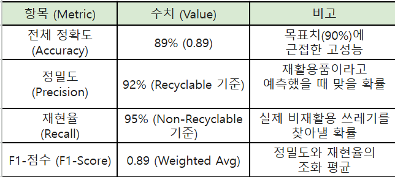
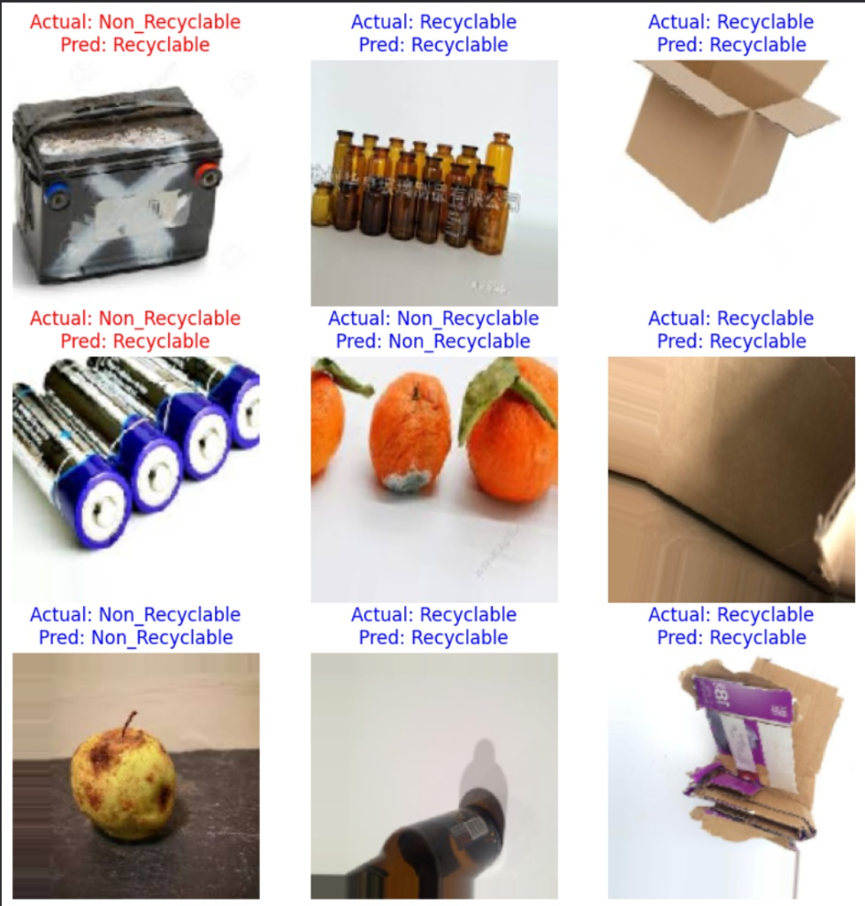
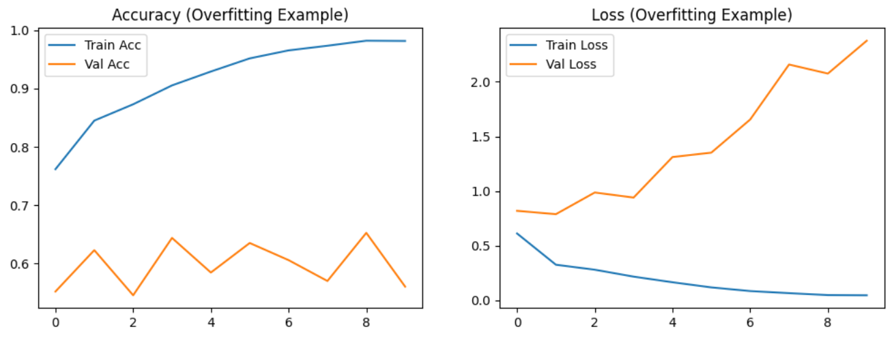
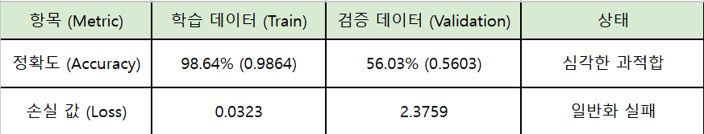

# recyclable-waste-classifier

재활용/비재활용 이진 분류기. Kaggle 의 12개 클래스 쓰레기 데이터셋을 2개
범주로 다시 묶고, MobileNetV2 전이학습으로 89% 정확도를 얻었다. 밑바닥
CNN 이 과적합으로 실패한 뒤 전이학습으로 넘어간 과정을 같이 남겼다.

## 데이터

[Garbage Classification (12 classes)](https://www.kaggle.com/datasets/mostafaabla/garbage-classification)
— 이미지 15,150장. 저장소에는 넣지 않는다. Kaggle 에서 직접 받아야 한다.

| 범주 | 원본 클래스 |
|------|-------------|
| Recyclable | cardboard, paper, plastic, metal, green-glass, brown-glass, white-glass |
| Non-Recyclable | battery, biological, clothes, shoes, trash |

## 실행

⚠️ `notebooks/recyclable_classifier_colab.py` 는 **Colab 노트북을 내보낸
파일이라 로컬에서 `python` 으로 바로 실행되지 않는다.** `!cp` 셸 매직과
`google.colab.drive` 가 들어 있어 29행에서 SyntaxError 가 난다.

지금 돌리려면 Colab 에 붙여넣고, 드라이브에 데이터셋을 올린 뒤
`data_dir` 를 자기 경로로 바꿔야 한다. 로컬에서 돌아가는 `train.py` 로
바꾸는 것이 이 저장소의 다음 할 일이다.

## 모델

```
MobileNetV2 (ImageNet 사전학습, base 동결)
    -> GlobalAveragePooling2D
    -> Dense(128, relu)
    -> Dropout(0.5)
    -> Dense(1, sigmoid)
```

- 전처리: MobileNetV2 의 `preprocess_input` ([-1, 1] 스케일)
- 증강: 회전 / 이동 / 전단 / 확대 / 좌우반전
- Adam(lr=1e-4), Binary Crossentropy, EarlyStopping(patience=5)
- 입력 160×160

## 결과

| 지표 | 값 |
|------|-----|
| Accuracy | 89% |
| Precision (Recyclable) | 92% |
| Recall (Non-Recyclable) | 95% |
| F1 (weighted) | 0.89 |



예측 예시. 배터리를 재활용품으로 잘못 분류하는 경우가 남아 있다.



## 왜 전이학습으로 갔나

처음에 쌓은 밑바닥 CNN 은 학습 정확도 98.64%, 검증 정확도 56.03% 로
전형적인 과적합이었다. 검증 손실은 학습이 진행될수록 오히려 올라갔다.




데이터를 더 모으는 대신 사전학습된 특징 추출기를 쓰고, base 를 동결한 채
분류기만 학습했다. 여기에 증강과 Dropout(0.5) 을 더해 격차를 줄였다.

## 알려진 문제

- 최종 모델의 학습 곡선 그림이 없다. 원래 올려 뒀던 그림은 검증 정확도가
  0.50 근처에 머무는 다른 시도의 결과였고, 본문의 89% 와 맞지 않아 지웠다.
  최종 모델로 다시 뽑아 넣어야 한다.
- 성능 수치가 단일 학습 1회 결과다. 시드를 바꿔 여러 번 돌린 값이 아니다.
- 12개 클래스를 2개로 묶는 규칙(`clothes`, `shoes` 를 비재활용으로 둔 것)은
  지자체 기준에 따라 달라진다. 이 저장소는 한 가지 기준만 쓴다.

## 구조

```
├── notebooks/recyclable_classifier_colab.py   # 학습 코드 (Colab 내보내기)
└── assets/                                    # 학습 곡선, 성능표, 예측 예시
```
